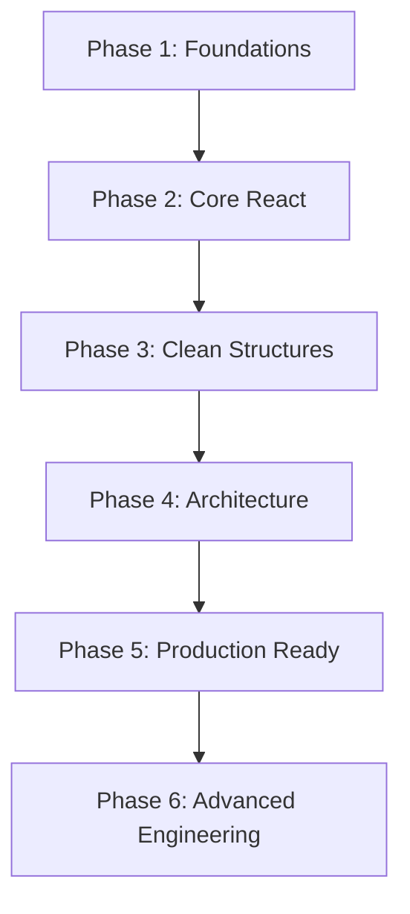

# Frontend Architecture & Engineering Roadmap

This roadmap is designed to guide your transition from writing working React code to building scalable, production-grade, and maintainable frontend systems. 

---

## 🗺️ The 6-Phase Frontend Roadmap



---

## Phase 1: The Core Foundations
Before touching frameworks, a deep mastery of the browser environment is crucial.

*   **HTML5 Semantic Markup**: Using proper elements (`<article>`, `<section>`, `<nav>`, `<header>`, `<footer>`) instead of endless `<div>` structures for SEO, readability, and accessibility (A11y).
*   **Modern CSS & Layouts**:
    *   **Layout Systems**: Flexbox & Grid for responsive, container-based styling.
    *   **Design Tokens**: CSS Custom Properties (Variables) for theming, spacing, and typography scales.
*   **JavaScript (ES6+) Core**:
    *   **Scoping & Closures**: Understanding `let`, `const`, block scope, and lexical scoping.
    *   **Asynchronous JavaScript**: Promises, `async/await`, microtasks vs. macrotasks, and handling API exceptions gracefully.
    *   **Array Methods**: Functional patterns using `.map()`, `.filter()`, `.reduce()`, `.some()`, and `.every()`.
*   **DOM Manipulation & Browser APIs**: Understanding how the browser renders pages (Critical Rendering Path) and utilizing local storage/session storage.

---

## Phase 2: Core React Concepts
React is a rendering library built on JavaScript. Mastering its lifecycle prevents performance bottlenecks.

*   **Declarative Rendering**: Thinking in states rather than mutating the DOM directly.
*   **Component Design**: Splitting interfaces into pure, single-responsibility components.
*   **State vs. Props**:
    *   **Props**: Read-only configuration passed down the tree.
    *   **State**: Local component memory that triggers re-renders on update.
*   **The Effect Lifecycle (`useEffect`)**:
    *   Understanding synchronization rather than component lifecycle emulation.
    *   Proper dependency array management to avoid infinite render loops.
    *   Cleanup functions (canceling subscriptions, aborting fetch requests).
*   **Forms & Validation**: Controlled vs. uncontrolled inputs, and handling form state submission safely.
*   **Routing**: Client-side navigation without full page reloads.

---

## Phase 3: Folder Structure & Clean Layouts
Organizing files so that any developer can find components in under 5 seconds.

```text
src/
├── assets/          # Static files (images, SVGs, icons, global styles)
├── components/      # Reusable UI components (Buttons, Inputs, Modals, Cards)
├── pages/           # High-level route views (Dashboard, Matches, Profile)
├── services/        # API layer, backend communication wrappers
└── utils/           # Helper functions, formatters, and validators
```

> [!TIP]
> Keep components and pages separate. **Pages** are tied to routes and manage data loading/orchestration. **Components** are structural, generic, and receive data/callbacks via props.

---

## Phase 4: Modular Project Architecture
As the project grows, split concerns by adding specialized layers.

```text
src/
├── api/             # Base Axios instance & configuration
├── assets/          # Static media assets
├── components/      # Common UI components
├── context/         # React Context providers for global state (Auth, Theme)
├── hooks/           # Custom reusable hooks
├── pages/           # Page views
├── services/        # Logic layer for API consumption
└── utils/           # Independent helper utilities
```

---

## Phase 5: Production-Ready Frontend
This is where frontend starts feeling like software engineering.

*   **Custom Hooks**: Moving stateful logic, side effects, and calculations out of the UI components (e.g., `useAuth`, `useFetch`, `useTheme`).
*   **Context API / State Management**: Managing global variables (authenticated user, settings, theme) cleanly without prop-drilling.
*   **API Client Layer**: centralizing API configurations, handling headers, request/response interceptors, and tokens.
*   **Authentication & Protected Routes**: Ensuring unauthorized users cannot access internal pages and automatically redirecting to login.
*   **Global Error Handling**: Implementing Error Boundaries to catch UI crashes and displaying friendly error states.

---

## Phase 6: Advanced Frontend Engineering
The delta between senior developers and standard developers.

*   **TypeScript**: Adding static type safety to identify bugs during compilation instead of at runtime.
*   **Server Cache (React Query / RTK Query)**: Discarding manual `useEffect` fetch patterns to utilize automatic caching, background revalidation, and loading state management.
*   **Automated Testing**:
    *   **Unit Tests**: Testing utility functions and pure logic.
    *   **Integration Tests**: Testing user interactions with React Testing Library.
*   **Performance Optimization**:
    *   Code-splitting & Lazy Loading (`React.lazy`, dynamic imports).
    *   Memoization (`useMemo`, `useCallback`, `React.memo`) to avoid redundant re-renders.
*   **CI/CD & System Design**: Building pipelines to run linters, tests, and automate deployment to CDNs.

---

## 📋 Project Status Checklist: `Resource Matcher`

Below is an assessment of the current **Resource Matcher** repository structure and architecture against this roadmap.

| Phase / Requirement | Current Implementation Status | Location / Reference | Action Item / Next Step |
| :--- | :--- | :--- | :--- |
| **Phase 1: Foundations** | 🟢 **Completed** | CSS Variables and styling rules are centralized in [index.css](file:///Users/Akhilan/Desktop/Folders/capstone_project/client/src/index.css). Semantic layout elements are used in [Sidebar.jsx](file:///Users/Akhilan/Desktop/Folders/capstone_project/client/src/components/Sidebar.jsx) and [Navbar.jsx](file:///Users/Akhilan/Desktop/Folders/capstone_project/client/src/components/Navbar.jsx). | Keep using design tokens for unified styling. |
| **Phase 2: React Core** | 🟡 **Needs Refactoring** | Page switching is coupled directly to the local `currentPage` state in [App.jsx](file:///Users/Akhilan/Desktop/Folders/capstone_project/client/src/App.jsx#L57) using a manual `renderPage()` function. | Refactor navigation to use a robust routing library (e.g. React Router or simple hash-based router) to enable URL bookmarking. |
| **Phase 3: Folder Structure** | 🟢 **Clean** | Structured nicely into [components](file:///Users/Akhilan/Desktop/Folders/capstone_project/client/src/components), [pages](file:///Users/Akhilan/Desktop/Folders/capstone_project/client/src/pages), [services](file:///Users/Akhilan/Desktop/Folders/capstone_project/client/src/services), and [assets](file:///Users/Akhilan/Desktop/Folders/capstone_project/client/src/assets). | Maintain this separation of UI elements, pages, and integrations. |
| **Phase 4: Modular Architecture** | 🟡 **In-Progress** | Base axios API endpoints are separated in [api.js](file:///Users/Akhilan/Desktop/Folders/capstone_project/client/src/services/api.js). | Create a base `axios` client instance inside an `api/` directory to handle global response interceptors. |
| **Phase 5: Production Ready** | 🔴 **Missing / Incomplete** | Themes and user auth states are managed manually in [App.jsx](file:///Users/Akhilan/Desktop/Folders/capstone_project/client/src/App.jsx) and passed down via props. 2FA challenge flow is hardcoded in [App.jsx](file:///Users/Akhilan/Desktop/Folders/capstone_project/client/src/App.jsx#L265). | Extract authentication, 2FA, and theme toggling into custom providers/hooks (`useAuth`, `useTheme`) using the React Context API to avoid prop-drilling. |
| **Phase 6: Advanced Frontend** | 🔴 **Missing** | The project is using JavaScript (`.jsx` / `.js`) with no typescript, testing libraries, or state managers. | Migrate high-impact components and page states to TypeScript, and add integration tests for critical flows like login/register. |

