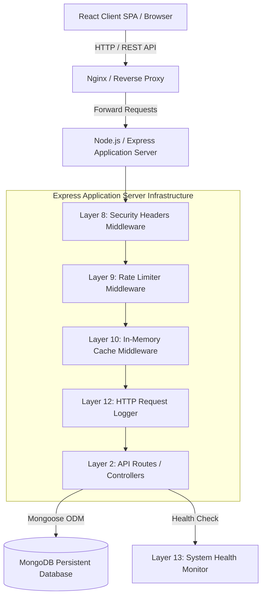
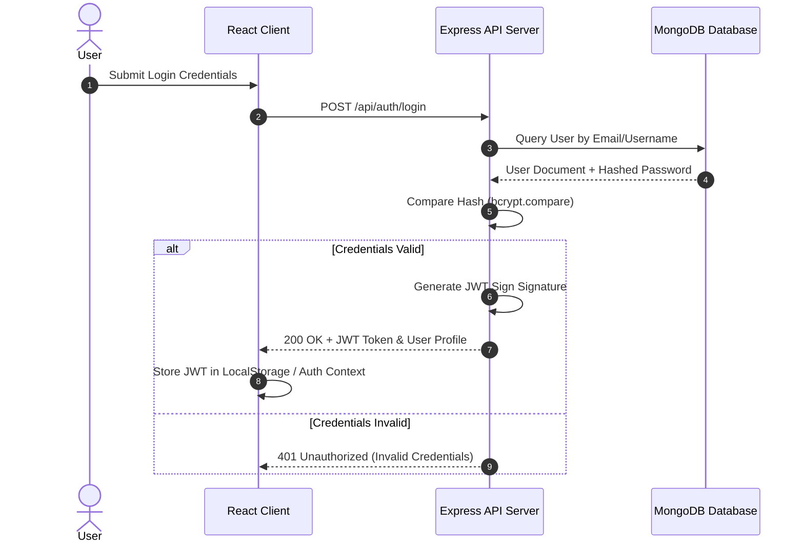
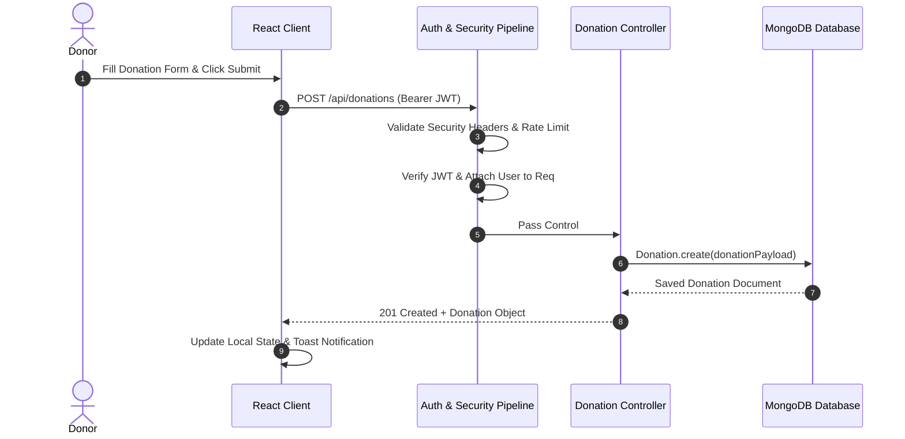

# High-Level Design (HLD)

## Project: Resource Matcher - Donation Platform

---

### 1. Architectural Overview

The **Resource Matcher** platform follows a decoupled, client-server **N-Tier Architecture**. The system comprises a React-based single-page application (SPA) frontend, an Express-powered RESTful API gateway/application tier, an in-memory caching and rate-limiting subsystem, and a persistent MongoDB database layer.

---

### 2. Subsystem Descriptions

#### 2.1 Presentation Tier (Frontend Client)
* **Framework**: React 18 powered by Vite.
* **Navigation & State**: React Router client-side routing, React Context API for global session and theme management (`useAuth`, `useTheme`).
* **UI Components**: Modular components (Navbar, Sidebar, Stats Cards, Donation List, Leaderboards, User Management).
* **HTTP Client**: Axios wrapper with global request/response interceptors for automatic JWT token injection and error handling.

#### 2.2 Application Tier (Backend Express Server)
* **Runtime**: Node.js v18+.
* **API Gateway & Routing**: Express routes separated by concern (`auth`, `donations`, `requests`, `users`, `categories`, `stats`, `system`, `health`, `seed`).
* **Middleware Pipeline**:
  * **Security Layer**: Custom security headers (XSS filtering, frameguard, content-type protection).
  * **Traffic Management**: Rate limiting applied to authentication (`authLimiter`) and global API endpoints (`apiLimiter`).
  * **Caching Layer**: Route-level TTL caching for frequently requested static or aggregated endpoints (`/api/stats`, `/api/categories`).
  * **Logging & Observability**: HTTP request duration logging and error tracking.

#### 2.3 Persistence Tier (Database)
* **Database Engine**: MongoDB (Local instance or MongoDB Atlas cloud cluster).
* **Object Document Mapper (ODM)**: Mongoose schemas enforcing model structure, validation rules, indexing, and virtual fields.

#### 2.4 Infrastructure & Container Layer
* **Containerization**: Docker container definitions for API Server, Client, and Nginx.
* **Orchestration**: `docker-compose` managing multi-container services, environment variables, network bridges, and volumes.

---

### 3. Data Flow & Sequence Diagrams

#### 3.1 User Authentication & Authorization Flow

#### 3.2 Donation Creation & Cataloging Flow

---

### 4. Non-Functional & Topology Design

#### 4.1 Scalability & Load Handling
* **Stateless API Design**: The application server stores no session state locally, allowing seamless horizontal scaling behind a load balancer (Nginx / HAProxy).
* **Caching Strategy**: Shared/in-memory cache reduces database queries for read-heavy routes (`/api/stats`, `/api/categories`).

#### 4.2 Security Architecture
* **Data in Transit**: Encrypted over TLS/HTTPS.
* **Data at Rest**: Passwords stored as `bcrypt` hashes with unique salts.
* **Defense in Depth**: Combination of Rate Limiting, CORS restrictions, JWT expiration, input validation, and Helmet-equivalent custom headers.
