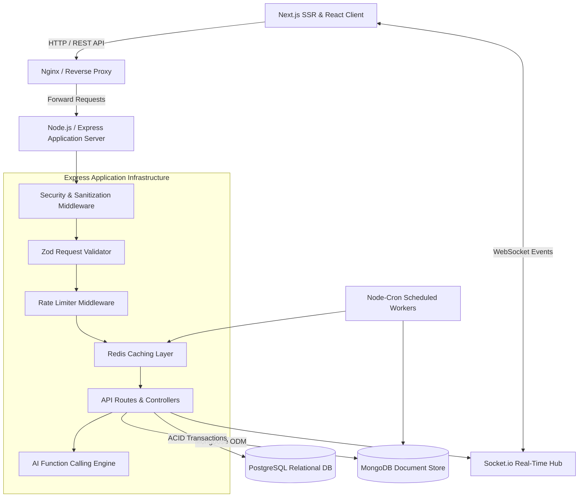
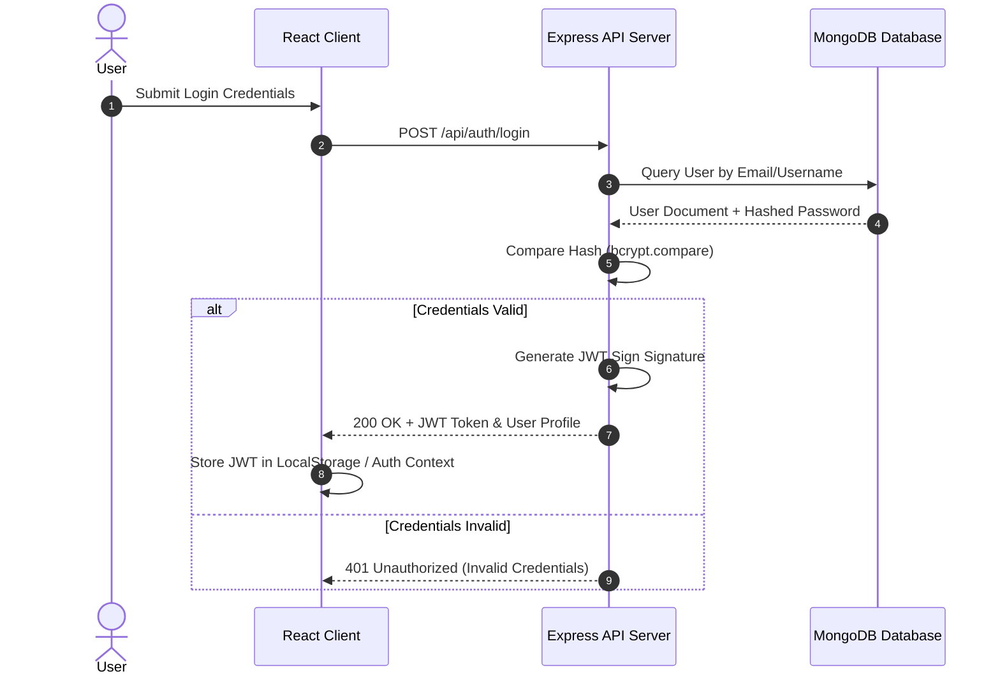
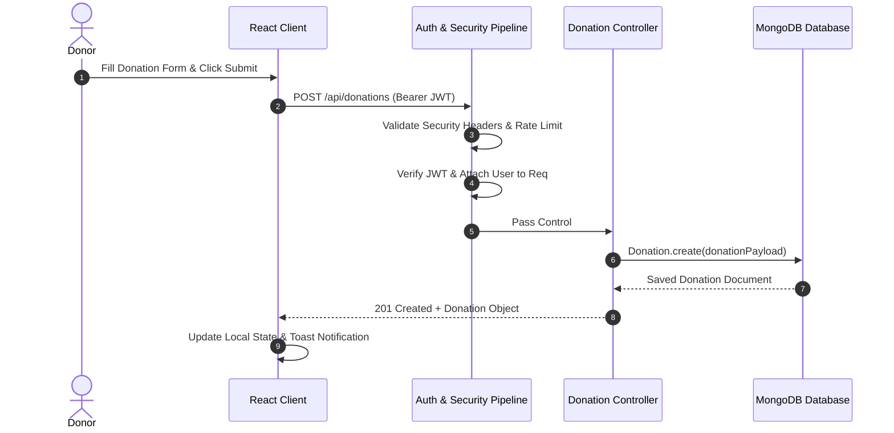

# High-Level Design (HLD)

## Project: Resource Matcher - Donation Platform

---

### 1. Architectural Overview

The **Resource Matcher** platform follows a decoupled, client-server **N-Tier Architecture**. The system comprises a React-based single-page application (SPA) frontend, an Express-powered RESTful API gateway/application tier, an in-memory caching and rate-limiting subsystem, and a persistent MongoDB database layer.

---

### 2. Subsystem Descriptions

#### 2.1 Presentation Tier (Frontend Client)
* **Framework**: Next.js App Router (SSR + Client Components) with React 19.
* **Navigation & State**: Server-rendered routing with hydration, React Context API for global session and theme management (`useAuth`, `useTheme`).
* **UI Components**: Modular responsive components (Navbar, Sidebar, Stats Cards, Donation List, Leaderboards, User Management).
* **JavaScript Core Concepts**: Validated event loop mechanics, Promise/Callback patterns, and Hoisting/TDZ management.

#### 2.2 Application Tier (Backend Express Server)
* **Runtime**: Node.js v18+.
* **API Gateway & Routing**: Express routes separated by concern (`auth`, `listings`, `matches`, `messages`, `notifications`, `admin`, `payments`, `ai`).
* **Middleware Pipeline**:
  * **Security & Validation Layer**: Helmet headers, XSS sanitizer, HPP protection, and strict Zod request schema validation.
  * **Traffic Management**: Express rate limiting applied to authentication and global API endpoints.
  * **Caching Layer**: Redis client with in-memory fallback for hot endpoints (`/api/v1/payments/analytics`, category statistics).
  * **Real-time WebSockets**: Socket.io server handling match alerts and live messaging.
  * **Background Cron Workers**: Scheduled jobs handling data hygiene, cache pre-computation, and health monitoring.
  * **AI Assistant**: LLM Function Calling engine with executable tool bindings.

#### 2.3 Persistence Tier (Hybrid Data Architecture)
* **NoSQL Engine (MongoDB)**: High-speed flexible document store for user profiles, donation/request listings, messages, and notifications with compound/text indexing.
* **Relational SQL Engine (PostgreSQL)**: Normalized 3NF transactional ledger (`donors`, `campaigns`, `monetary_transactions`, `audit_logs`) enforcing foreign key constraints, indexing, and multi-table ACID transactions.

#### 2.4 Infrastructure & Container Layer
* **Containerization**: Docker container definitions for API Server, Client, and Nginx.
* **Orchestration**: `docker-compose` managing multi-container services, environment variables, network bridges, and volumes.

---

### 3. Data Flow & Sequence Diagrams

#### 3.1 User Authentication & Authorization Flow

#### 3.2 Donation Creation & Cataloging Flow

---

### 4. Non-Functional & Topology Design

#### 4.1 Scalability & Load Handling
* **Stateless API Design**: The application server stores no session state locally, allowing seamless horizontal scaling behind a load balancer (Nginx / HAProxy).
* **Caching Strategy**: Shared/in-memory cache reduces database queries for read-heavy routes (`/api/stats`, `/api/categories`).

#### 4.2 Security Architecture
* **Data in Transit**: Encrypted over TLS/HTTPS.
* **Data at Rest**: Passwords stored as `bcrypt` hashes with unique salts.
* **Defense in Depth**: Combination of Rate Limiting, CORS restrictions, JWT expiration, input validation, and Helmet-equivalent custom headers.
